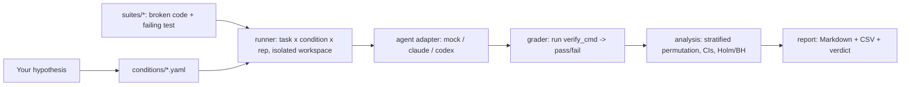
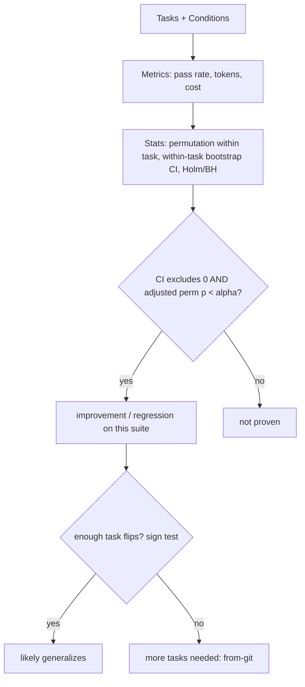

# cc-bench

**Does your `CLAUDE.md` actually help? A score and a confidence interval, not vibes.**

```bash
uvx --from git+https://github.com/Galou3/cc-bench ccbench doctor
```

[](https://github.com/Galou3/cc-bench/actions/workflows/ci.yml)

[](LICENSE)

One zero-install command audits your Claude Code / Codex setup against cited
evidence and scores it /100. Then, when you want proof a config change *actually*
helps, cc-bench turns your own repo into a benchmark and answers with a
confidence interval - or an honest "not proven".

> **Status: alpha.** The mock pipeline runs end-to-end today with zero API cost;
> the real `claude` adapter works and an experimental `codex` adapter is included.
> Every recommendation the project ships is traceable to [`EVIDENCE.md`](EVIDENCE.md).

---

## Make your setup better in 30 seconds (free, offline)

Your AI coder's output depends on *how it's set up* - yet most "best practices"
("write a `CLAUDE.md`", "keep context small", "use plan mode") are folklore nobody
checks. Start by fixing yours:

```bash
# zero-install (uv):
uvx --from git+https://github.com/Galou3/cc-bench ccbench doctor

# or classic:
pip install git+https://github.com/Galou3/cc-bench
ccbench doctor          # audit your CLAUDE.md / AGENTS.md / settings.json
ccbench doctor --fix    # apply safe fixes (e.g. drop a concise starter CLAUDE.md)
ccbench doctor --badge .ccbench/badge.json   # shields.io badge for your README
```

`doctor` flags what's likely costing you quality - a 600-line `CLAUDE.md`, a broken
`settings.json`, a `MEMORY.md` past the load limit - and tells you exactly how to
fix it, each with a citation into [`EVIDENCE.md`](EVIDENCE.md). Works for Claude
Code **and** Codex (`AGENTS.md`). No API key, no cost.

## Then prove it actually helps

Folklore is cheap. cc-bench lets you *measure* whether a setup change really moves
your agent's success rate - on your own tasks, not someone's blog:

```bash
ccbench run --suite suites/sample --conditions conditions --agent mock --reps 30
```

Example output (the bundled mock agent; full file in
[`examples/sample-report.md`](examples/sample-report.md)):

| Condition | mean delta/task | p (perm, holm) | tasks +/=/- | verdict on this suite |
|---|---:|---:|:---:|:--|
| `with-claude-md` | **+30.0%** | 0.0012 | 3/0/0 | [+] improvement |
| `placebo-claude-md` | +4.4% | 0.6409 | 2/0/1 | [~] not proven |
| `bloated-context` | -13.3% | 0.1352 | 1/0/2 | [~] not proven |

Three things to read in that table:
- the planted effect is detected (`with-claude-md`, permutation p = 0.001);
- the **placebo** (a same-length, content-free CLAUDE.md) correctly shows
  nothing, a negative control most eval tools do not even have;
- every verdict says *on this suite*: with only 3 tasks cc-bench also reports
  "generalization: not proven" instead of pretending 30 reps of the same tasks
  prove a universal claim. Honesty is the default.

> The mock uses *injected* ground-truth probabilities, so these numbers prove the
> **harness can detect an effect of that size at that n** - not anything about a
> real agent. Swap in `--agent claude` to measure for real.

## How cc-bench compares

- **Setup linters** (agnix, claudelint, AgentLint) check your `CLAUDE.md` / `AGENTS.md`
  statically and ship far more rules than `ccbench doctor`. They stop there: by their
  own admission they measure *harness health, not agent success*. `doctor` is the
  on-ramp here, not the product.
- **The product is the proof.** cc-bench is the only free, local tool that A/B-tests a
  setup change on *your own tasks* with real inferential statistics (Wilson + bootstrap
  CIs, multiplicity correction, an honest "not proven"), grades by *running the real
  tests* (no LLM-judge noise), and does it for **Claude and Codex**. The closest
  measurement tools either skip significance (jchilcher's claude-benchmark, Anthropic's
  skill A/B) or are paid SaaS (Braintrust).
- **Optimizers are friends, not rivals.** Improve a config with DSPy / GEPA / CodexOpt,
  then *certify the gain* with cc-bench. Optimize, then prove.

Full map in [PRIOR_ART.md](PRIOR_ART.md).

## How it works



Three orthogonal pieces:

- **Tasks** - small, self-contained problems. Each is *broken code + a failing
  test*; success = the test passes. Deterministic, execution-based, no LLM judge.
- **Conditions** - declarative descriptions of *how* the agent is invoked
  (baseline vs. a `CLAUDE.md` present vs. a bloated context...). A condition is
  data, not code, with its own rationale + citation into `EVIDENCE.md`.
- **Runner -> analysis -> report** - every `(task, condition, rep)` runs in a fresh
  isolated workspace; results become a pass rate with a confidence interval and an
  honest significance verdict.

## Why you can trust the numbers



- **Two-level verdicts.** Runs cluster by task (agents are often near-deterministic
  per task), so cc-bench never pools reps as if they were independent. Level 1: a
  **stratified permutation test** (labels shuffled within each task) + a
  within-task bootstrap CI decide the effect *on this suite*. Level 2: an exact
  **sign test on task flips** decides whether it *generalizes*; few tasks means
  "not proven", never a universal claim.
- **Controls built in.** A **placebo condition** (same-length, content-free
  CLAUDE.md) separates "the content helps" from "any file helps", and flags a
  broken harness if it ever "wins".
- **Wilson** intervals for descriptive rates, **Holm-Bonferroni / BH-FDR** for
  multiple comparisons, and a two-gate rule (CI excludes 0 AND adjusted p < alpha).
- The statistics are themselves **unit-tested**: seeded Monte Carlos
  ([`tests/test_calibration.py`](tests/test_calibration.py),
  [`tests/test_stratified.py`](tests/test_stratified.py)) prove the pipeline
  detects real effects, stays calibrated under task heterogeneity, and does not
  manufacture wins under the null. The stratified analysis exists because we
  attacked our own tool and found the pooled version could overstate scope.

Full rationale and limits in [`METHODOLOGY.md`](METHODOLOGY.md). Prior art and how
cc-bench differs in [`PRIOR_ART.md`](PRIOR_ART.md).

## The metric: config lift

**Config lift** = the mean per-task change in pass rate between two setups on the
same suite, reported with a within-task bootstrap CI and a within-task permutation
p-value (Holm-adjusted across variants). A lift is only called real when the CI
excludes 0 AND p < 0.05; generalization beyond the suite is judged separately by a
sign test on task flips. Plan your sample size with `ccbench power --baseline 0.4
--effect 0.15`, and verify your install recovers a planted +50pp lift with one
command:

```bash
ccbench selftest    # offline, ~1 min: must print "selftest OK"
```

## Guard your config in CI

Add the bundled GitHub Action so every PR touching your agent config gets audited
(free, no API key):

```yaml
on:
  pull_request:
    paths: ["CLAUDE.md", "AGENTS.md", ".claude/**"]
jobs:
  audit:
    runs-on: ubuntu-latest
    steps:
      - uses: actions/checkout@v5
      - uses: Galou3/cc-bench@main
```

## Measure a real agent

```bash
# Requires the `claude` CLI authenticated; runs cost tokens.
ccbench run --suite suites/sample --conditions conditions \
            --agent claude --reps 10 --report
```

The adapter calls `claude -p ... --output-format json` in each workspace, parses
real token/cost usage, and grades independently. Bring your own auth.

## Use it on your own project (no tasks to write)

The hard part of "measure on your own tasks" is writing the tasks. cc-bench builds
them from code you already have, two ways:

```bash
# From your git history (SWE-bench-style, on YOUR repo): pick a commit that changed
# source + tests; cc-bench resets the source and holds out the commit's tests.
ccbench from-git --commit <sha> --id fix-123

# Or from a single tested module: stub its implementation, hold out its tests.
ccbench from-repo --module src/parser.py --test tests/test_parser.py --id parser

ccbench run --suite ccbench_suite --conditions conditions --agent claude --reps 10
```

That is the part no competitor can assemble: your repo becomes the benchmark, then
you measure which setup changes actually help it. Grading can run in an isolated
Docker sandbox (`--sandbox docker`), and the graded tests are held out so the agent
can never edit them (an Anthropic-recommended guardrail).

### Or write a suite by hand

A suite and conditions are just YAML + folders - drop them next to your code:

```
suites/mysuite/
  tasks.yaml                 # id, prompt, template_dir, verify_cmd, ...
  tasks/<id>/workspace/      # broken code (copied per run; the agent works here)
  tasks/<id>/reference/      # the fix (held out; never shown to a real agent)
  tasks/<id>/hidden/         # held-out tests, injected only at GRADING time (optional)
conditions/
  baseline.yaml
  my-idea.yaml               # inject_files, agent_args, rationale, citation
```

For **hard** tasks, put the grading tests under `hidden/` and set `hidden_tests_dir`:
they are copied in only *after* the agent finishes, so it can't read or overfit
them - that's what keeps the pass rate off the 100% ceiling (see `suites/hard/`).

Then `ccbench run --suite suites/mysuite --conditions conditions --agent claude`.
`verify_cmd` is any command (`pytest`, `npm test`, `go test`...), so cc-bench is
language-agnostic.

## Commands at a glance

| Command | What it does |
|---|---|
| `ccbench doctor [--fix]` | audit (and safely fix) your `CLAUDE.md` / `AGENTS.md` / `settings.json` against the evidence |
| `ccbench from-git --commit SHA --id ID` | build a held-out task from your git history (SWE-bench-style, on your repo) |
| `ccbench from-repo --module M --test T --id ID` | turn a single tested module into a held-out task |
| `ccbench validate --suite DIR` | check every task discriminates (workspace fails, reference passes) |
| `ccbench init` | scaffold a runnable starter suite + conditions into any repo |
| `ccbench run --agent mock\|claude\|codex` | run a suite across conditions; save a report |
| `ccbench run --seeds 0,1,2` | multi-seed run -> robustness (mean +/- SD per condition) |
| `ccbench compare runA runB` | head-to-head of two runs (e.g. **claude vs codex**) |
| `ccbench report <dir> [--html r.html]` | render Markdown/CSV/shareable HTML from a saved run |
| `ccbench power --baseline 0.4 --effect 0.15` | runs needed before an effect is even detectable |
| `ccbench selftest` | prove your install recovers a planted effect (offline) |
| `ccbench agents` | list available agents |

## Project layout

| Path | What |
|---|---|
| `ccbench/` | library: models, suite, workspace, verify, agents, runner, analysis, report, cli |
| `suites/sample/` | 3-task offline demo suite |
| `conditions/` | baseline / with-claude-md / bloated-context |
| `tests/` | the test suite, incl. calibration and anti-tampering proofs |
| `EVIDENCE.md` | 40 cited sources behind every recommendation |
| `METHODOLOGY.md` | stats + threats to validity |
| `.github/workflows/ci.yml` | CI: pytest 3.10-3.12 + mock smoke on every push |

## En français

cc-bench mesure si une façon d'utiliser un agent de code (un `CLAUDE.md`, le mode
plan...) **change réellement** le taux de réussite, avec intervalles de confiance et
un verdict honnête (« prouvé » / « non prouvé »). Démo sans clé API :
`ccbench run --suite suites/sample --conditions conditions --agent mock`. Voir
[`examples/`](examples/) et [`ROADMAP.md`](ROADMAP.md).

## Contributing & license

Contributions welcome - see [CONTRIBUTING.md](CONTRIBUTING.md) and the
[Code of Conduct](CODE_OF_CONDUCT.md). Licensed under [MIT](LICENSE).
