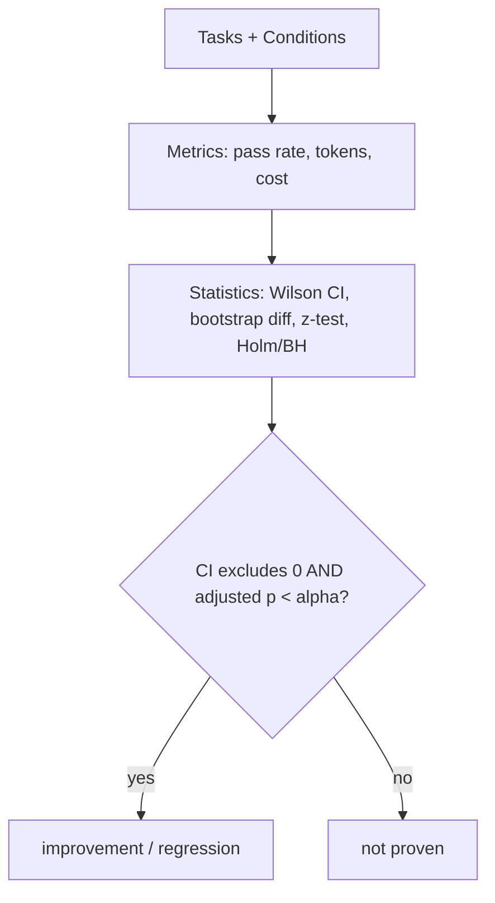

# cc-bench

**Does your Claude Code setup actually help?** A reproducible, evidence-based
benchmark harness that measures whether a way of *using* a coding agent
(a `CLAUDE.md`, plan mode, a context strategy…) really changes the task success
rate — with confidence intervals, not vibes.


[](LICENSE)

<sub>CI config lives in [`ci/ci.yml`](ci/ci.yml); move it to `.github/workflows/`
to activate Actions (see the file header).</sub>

> **Status: alpha.** The mock pipeline runs end-to-end today with zero API cost;
> the real `claude` adapter works and an experimental `codex` adapter is included.
> Every recommendation the project ships is traceable to [`EVIDENCE.md`](EVIDENCE.md).

---

## The problem

There is a lot of *folklore* about using a coding agent well — "write a
`CLAUDE.md`", "use plan mode", "keep the context small". Most of it is plausible.
Almost none of it is **measured** on your own tasks. So you can't tell whether a
tweak helped, hurt, or just burned tokens.

cc-bench turns *"I think this helps"* into *"this moved the pass rate from X% to
Y% (95% CI …, n = Z, p = …)"* — and it refuses to call a noisy difference a win.

## See it in 30 seconds (no API key, no cost)

```bash
pip install -e .
ccbench run --suite suites/sample --conditions conditions --agent mock --reps 30
```

Example output (the bundled mock agent; full file in
[`examples/sample-report.md`](examples/sample-report.md)):

| Condition | Pass rate | 95% CI | Δ vs baseline | p (holm) | verdict |
|---|---:|---:|---:|---:|:--|
| `baseline` | 34.4% | [25.4%, 44.7%] | — | — | — |
| `with-claude-md` | 64.4% | [54.2%, 73.6%] | **+30.0%** | 0.0001 | ✅ improvement |
| `bloated-context` | 21.1% | [14.0%, 30.6%] | −13.3% | 0.0458 | 〜 not proven |

Read that third row carefully — it is the whole point. The bloated-context drop
*looks* significant (p = 0.046), but its bootstrap CI touches 0, so cc-bench
reports **not proven** rather than overclaim. Honesty is the default.

> The mock uses *injected* ground-truth probabilities, so these numbers prove the
> **harness can detect an effect of that size at that n** — not anything about a
> real agent. Swap in `--agent claude` to measure for real.

## How it works


Three orthogonal pieces:

- **Tasks** — small, self-contained problems. Each is *broken code + a failing
  test*; success = the test passes. Deterministic, execution-based, no LLM judge.
- **Conditions** — declarative descriptions of *how* the agent is invoked
  (baseline vs. a `CLAUDE.md` present vs. a bloated context…). A condition is
  data, not code, with its own rationale + citation into `EVIDENCE.md`.
- **Runner → analysis → report** — every `(task, condition, rep)` runs in a fresh
  isolated workspace; results become a pass rate with a confidence interval and an
  honest significance verdict.

## Why you can trust the numbers



- **Wilson** intervals for rates, **bootstrap CI + two-proportion z-test** for
  differences, **Holm-Bonferroni / BH-FDR** for multiple comparisons.
- A result is "significant" only if the **CI excludes 0 _and_** the adjusted
  **p < α**. Otherwise: *not proven*.
- The statistics are themselves **unit-tested**: a seeded Monte Carlo
  ([`tests/test_calibration.py`](tests/test_calibration.py)) proves the pipeline
  detects real effects and does not manufacture them under the null.

Full rationale and limits in [`METHODOLOGY.md`](METHODOLOGY.md). Prior art and how
cc-bench differs in [`PRIOR_ART.md`](PRIOR_ART.md).

## Measure a real agent

```bash
# Requires the `claude` CLI authenticated; runs cost tokens.
ccbench run --suite suites/sample --conditions conditions \
            --agent claude --reps 10 --report
```

The adapter calls `claude -p … --output-format json` in each workspace, parses
real token/cost usage, and grades independently. Bring your own auth.

## Use it on your own project

A suite and conditions are just YAML + folders — drop them next to your code:

```
suites/mysuite/
  tasks.yaml                 # id, prompt, template_dir, verify_cmd, ...
  tasks/<id>/workspace/      # broken code + a failing test (copied per run)
  tasks/<id>/reference/      # the fix (held out; never shown to a real agent)
conditions/
  baseline.yaml
  my-idea.yaml               # inject_files, agent_args, rationale, citation
```

Then `ccbench run --suite suites/mysuite --conditions conditions --agent claude`.
`verify_cmd` is any command (`pytest`, `npm test`, `go test`…), so cc-bench is
language-agnostic.

## Project layout

| Path | What |
|---|---|
| `ccbench/` | library: models, suite, workspace, verify, agents, runner, analysis, report, cli |
| `suites/sample/` | 3-task offline demo suite |
| `conditions/` | baseline / with-claude-md / bloated-context |
| `tests/` | 41 tests incl. the calibration proof |
| `EVIDENCE.md` | 40 cited sources behind every recommendation |
| `METHODOLOGY.md` | stats + threats to validity |
| `ci/ci.yml` | CI workflow (move to `.github/workflows/` to activate) |

## En français

cc-bench mesure si une façon d'utiliser un agent de code (un `CLAUDE.md`, le mode
plan…) **change réellement** le taux de réussite, avec intervalles de confiance et
un verdict honnête (« prouvé » / « non prouvé »). Démo sans clé API :
`ccbench run --suite suites/sample --conditions conditions --agent mock`. Voir
[`examples/`](examples/) et [`ROADMAP.md`](ROADMAP.md).

## Contributing & license

Contributions welcome — see [CONTRIBUTING.md](CONTRIBUTING.md) and the
[Code of Conduct](CODE_OF_CONDUCT.md). Licensed under [MIT](LICENSE).
