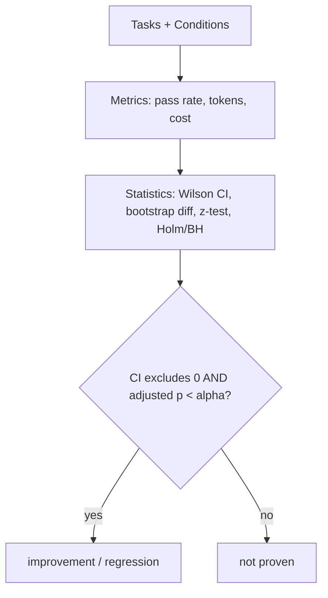

# cc-bench

**Make Claude Code & Codex measurably better - audit, fix, prove.**

[](https://github.com/Galou3/cc-bench/actions/workflows/ci.yml)

[](LICENSE)

cc-bench finds what's quietly holding your AI coder back - a bloated `CLAUDE.md`, a
misconfigured setup - and fixes it in one command. When you want proof a change
*actually* helps, it measures it on your own tasks (real statistics underneath, for
when you ask "but does it really work?").

> **Status: alpha.** The mock pipeline runs end-to-end today with zero API cost;
> the real `claude` adapter works and an experimental `codex` adapter is included.
> Every recommendation the project ships is traceable to [`EVIDENCE.md`](EVIDENCE.md).

---

## Make your setup better in 30 seconds (free, offline)

Your AI coder's output depends on *how it's set up* - yet most "best practices"
("write a `CLAUDE.md`", "keep context small", "use plan mode") are folklore nobody
checks. Start by fixing yours:

```bash
pip install -e .
ccbench doctor          # audit your CLAUDE.md / AGENTS.md / settings.json
ccbench doctor --fix    # apply safe fixes (e.g. drop a concise starter CLAUDE.md)
```

`doctor` flags what's likely costing you quality - a 600-line `CLAUDE.md`, a broken
`settings.json`, a `MEMORY.md` past the load limit - and tells you exactly how to
fix it, each with a citation into [`EVIDENCE.md`](EVIDENCE.md). Works for Claude
Code **and** Codex (`AGENTS.md`). No API key, no cost.

## Then prove it actually helps

Folklore is cheap. cc-bench lets you *measure* whether a setup change really moves
your agent's success rate - on your own tasks, not someone's blog:

```bash
ccbench run --suite suites/sample --conditions conditions --agent mock --reps 30
```

Example output (the bundled mock agent; full file in
[`examples/sample-report.md`](examples/sample-report.md)):

| Condition | Pass rate | 95% CI | Δ vs baseline | p (holm) | verdict |
|---|---:|---:|---:|---:|:--|
| `baseline` | 34.4% | [25.4%, 44.7%] | - | - | - |
| `with-claude-md` | 64.4% | [54.2%, 73.6%] | **+30.0%** | 0.0001 | ✅ improvement |
| `bloated-context` | 21.1% | [14.0%, 30.6%] | -13.3% | 0.0458 | ~ not proven |

Read that third row carefully - it is the whole point. The bloated-context drop
*looks* significant (p = 0.046), but its bootstrap CI touches 0, so cc-bench
reports **not proven** rather than overclaim. Honesty is the default.

> The mock uses *injected* ground-truth probabilities, so these numbers prove the
> **harness can detect an effect of that size at that n** - not anything about a
> real agent. Swap in `--agent claude` to measure for real.

## How it works


Three orthogonal pieces:

- **Tasks** - small, self-contained problems. Each is *broken code + a failing
  test*; success = the test passes. Deterministic, execution-based, no LLM judge.
- **Conditions** - declarative descriptions of *how* the agent is invoked
  (baseline vs. a `CLAUDE.md` present vs. a bloated context...). A condition is
  data, not code, with its own rationale + citation into `EVIDENCE.md`.
- **Runner -> analysis -> report** - every `(task, condition, rep)` runs in a fresh
  isolated workspace; results become a pass rate with a confidence interval and an
  honest significance verdict.

## Why you can trust the numbers



- **Wilson** intervals for rates, **bootstrap CI + two-proportion z-test** for
  differences, **Holm-Bonferroni / BH-FDR** for multiple comparisons.
- A result is "significant" only if the **CI excludes 0 _and_** the adjusted
  **p < α**. Otherwise: *not proven*.
- The statistics are themselves **unit-tested**: a seeded Monte Carlo
  ([`tests/test_calibration.py`](tests/test_calibration.py)) proves the pipeline
  detects real effects and does not manufacture them under the null.

Full rationale and limits in [`METHODOLOGY.md`](METHODOLOGY.md). Prior art and how
cc-bench differs in [`PRIOR_ART.md`](PRIOR_ART.md).

## Measure a real agent

```bash
# Requires the `claude` CLI authenticated; runs cost tokens.
ccbench run --suite suites/sample --conditions conditions \
            --agent claude --reps 10 --report
```

The adapter calls `claude -p ... --output-format json` in each workspace, parses
real token/cost usage, and grades independently. Bring your own auth.

## Use it on your own project

A suite and conditions are just YAML + folders - drop them next to your code:

```
suites/mysuite/
  tasks.yaml                 # id, prompt, template_dir, verify_cmd, ...
  tasks/<id>/workspace/      # broken code (copied per run; the agent works here)
  tasks/<id>/reference/      # the fix (held out; never shown to a real agent)
  tasks/<id>/hidden/         # held-out tests, injected only at GRADING time (optional)
conditions/
  baseline.yaml
  my-idea.yaml               # inject_files, agent_args, rationale, citation
```

For **hard** tasks, put the grading tests under `hidden/` and set `hidden_tests_dir`:
they are copied in only *after* the agent finishes, so it can't read or overfit
them - that's what keeps the pass rate off the 100% ceiling (see `suites/hard/`).

Then `ccbench run --suite suites/mysuite --conditions conditions --agent claude`.
`verify_cmd` is any command (`pytest`, `npm test`, `go test`...), so cc-bench is
language-agnostic.

## Commands at a glance

| Command | What it does |
|---|---|
| `ccbench doctor [--fix]` | audit (and safely fix) your `CLAUDE.md` / `AGENTS.md` / `settings.json` against the evidence |
| `ccbench init` | scaffold a runnable starter suite + conditions into any repo |
| `ccbench run --agent mock\|claude\|codex` | run a suite across conditions; save a report |
| `ccbench run --seeds 0,1,2` | multi-seed run -> robustness (mean +/- SD per condition) |
| `ccbench compare runA runB` | head-to-head of two runs (e.g. **claude vs codex**) |
| `ccbench report <dir>` | render Markdown/CSV from a saved run |
| `ccbench agents` | list available agents |

## Project layout

| Path | What |
|---|---|
| `ccbench/` | library: models, suite, workspace, verify, agents, runner, analysis, report, cli |
| `suites/sample/` | 3-task offline demo suite |
| `conditions/` | baseline / with-claude-md / bloated-context |
| `tests/` | 41 tests incl. the calibration proof |
| `EVIDENCE.md` | 40 cited sources behind every recommendation |
| `METHODOLOGY.md` | stats + threats to validity |
| `.github/workflows/ci.yml` | CI: pytest 3.10-3.12 + mock smoke on every push |

## En français

cc-bench mesure si une façon d'utiliser un agent de code (un `CLAUDE.md`, le mode
plan...) **change réellement** le taux de réussite, avec intervalles de confiance et
un verdict honnête (« prouvé » / « non prouvé »). Démo sans clé API :
`ccbench run --suite suites/sample --conditions conditions --agent mock`. Voir
[`examples/`](examples/) et [`ROADMAP.md`](ROADMAP.md).

## Contributing & license

Contributions welcome - see [CONTRIBUTING.md](CONTRIBUTING.md) and the
[Code of Conduct](CODE_OF_CONDUCT.md). Licensed under [MIT](LICENSE).
