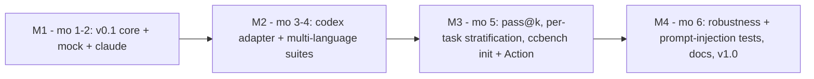

# Roadmap

**North star:** become the standard, rigorous way to test whether *how you use a
coding agent* actually helps — adopted widely enough to make "measure it" the
default instead of folklore.

> **Honesty note.** Popularity targets (e.g. "5,000 GitHub stars") and headline
> benchmark numbers are *aspirations with a method attached*, not promises. Stars
> follow real usefulness and are outside any author's direct control; cc-bench
> will never inflate them artificially. The **internal, measurable** criteria
> below are what the project actually commits to.

## Delivered (v0.1)

- [x] Declarative suites + conditions (YAML), held-out reference solutions.
- [x] Isolated per-run workspaces; execution-based grading (4-way outcome).
- [x] Deterministic, zero-cost mock agent; real `claude -p` adapter.
- [x] Wilson rate CIs, bootstrap difference CI, two-proportion z-test.
- [x] Multiple-comparison correction (Holm-Bonferroni, BH-FDR).
- [x] Markdown/CSV reports with an honest two-gate verdict.
- [x] 41 tests incl. a seeded **calibration** proof; CI on Python 3.10–3.12.
- [x] Evidence base of 40 cited sources ([`EVIDENCE.md`](EVIDENCE.md)).

## SMART objectives (12-month horizon)

- **Specific** — ship a CLI + library (and a thin VS Code task / GitHub Action)
  to A/B coding-agent configurations on user-supplied tasks.
- **Measurable** — internal: ≥ 90% line coverage on `ccbench/`; calibration test
  green; a real-agent case study with a statistically significant result.
  External (aspirational): GitHub stars and downstream adoption.
- **Achievable** — the engine is provider-agnostic (adapters) and language-
  agnostic (`verify_cmd`), so new agents/languages are additive, not rewrites.
- **Realistic** — target 5 common languages via example suites within the year
  (Python, JavaScript, Go, Java, C++) — each is "add a suite", not new code.
- **Time-bound** — milestones M1–M4 below, each with a date window.

## Milestones

- **M1 (months 1–2) — v0.1 core.** Done: harness, mock + claude adapters, stats,
  tests, CI, evidence base.
- **M2 (months 3–4) — breadth.** Codex adapter; JS/Go/Java/C++ example suites;
  Claude-vs-Codex case study on identical tasks.
- **M3 (month 5) — depth.** `pass@k` metric; per-task stratified estimates
  (mitigate Simpson's paradox); `ccbench init` scaffolder; reusable GitHub Action.
- **M4 (month 6) — hardening & v1.0.** Robustness (variance across seeds/prompt
  paraphrases), prompt-injection / adversarial condition tests, optional static-
  analysis of generated code, full docs, release.

## Metrics tracked

| Metric | How measured |
|---|---|
| Pass rate / `pass@k` | execution-based grading over reps |
| Effect size + CI | bootstrap difference CI, Wilson per-rate |
| Significance | two-proportion z-test + Holm/BH correction |
| Cost & tokens | parsed from the agent adapter (real runs) |
| Latency / wall-time | recorded per run |
| Robustness | variance of pass rate across seeds & prompt paraphrases |
| Language coverage | number of example suites passing CI |
| Install friction | deps count + cold-install time (target < 3 min) |
| Security | adversarial/prompt-injection conditions; optional static scan |

## Internal success criteria (v1.0)

- Calibration test green; ≥ 90% coverage on `ccbench/`.
- ≥ 5 language suites runnable; mock pipeline runs in CI with zero secrets.
- At least one **reproducible, statistically significant** real-agent finding
  published with full scripts + seeds.

## Risks & limitations

- **Provider/API drift.** `claude`/`codex` CLI output formats change; parsing is
  isolated + defensive, and pinned in docs per version.
- **Nondeterminism.** Real agents are stochastic — handled by reps + CIs, but
  small suites still swing; we surface n and intervals.
- **Contamination & overfitting.** Public tasks may be trained on; prefer private
  tasks for absolute claims (relative comparisons largely cancel it).
- **Prompt injection.** Malicious task/condition content could try to subvert a
  run; the workspace path-escape guard is a first measure, with adversarial tests
  planned (OWASP GenAI guidance).
- **Cost & latency** of real runs can dominate; reported per run so trade-offs are
  explicit.
- **External targets** (stars, "beating" other tools) depend on adoption and are
  reported honestly, never gamed.
